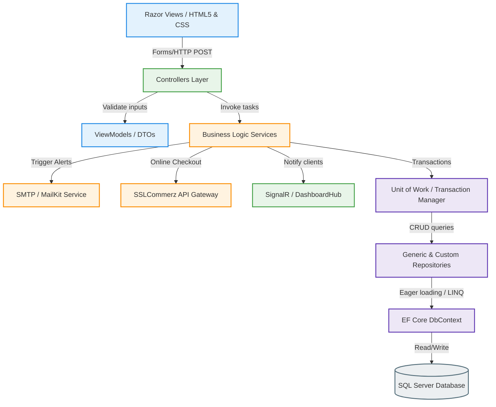
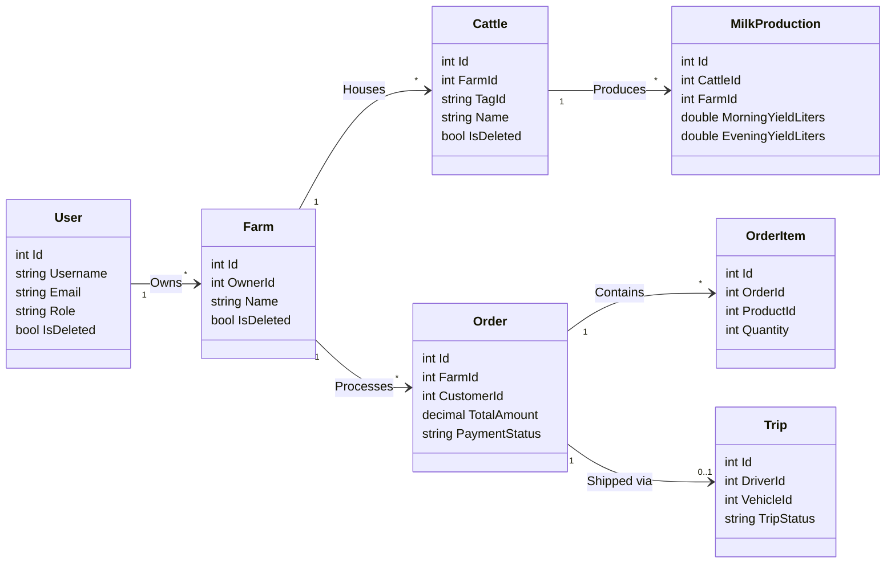
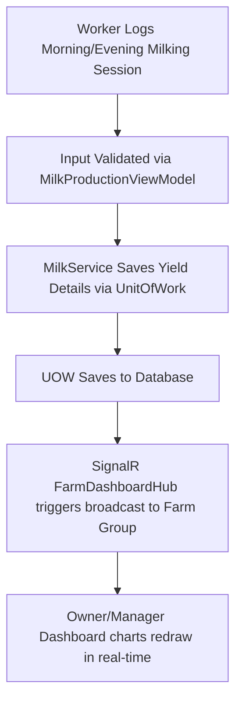
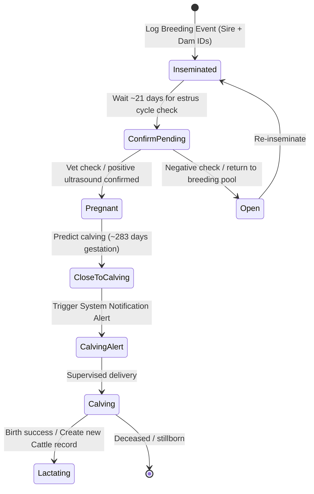
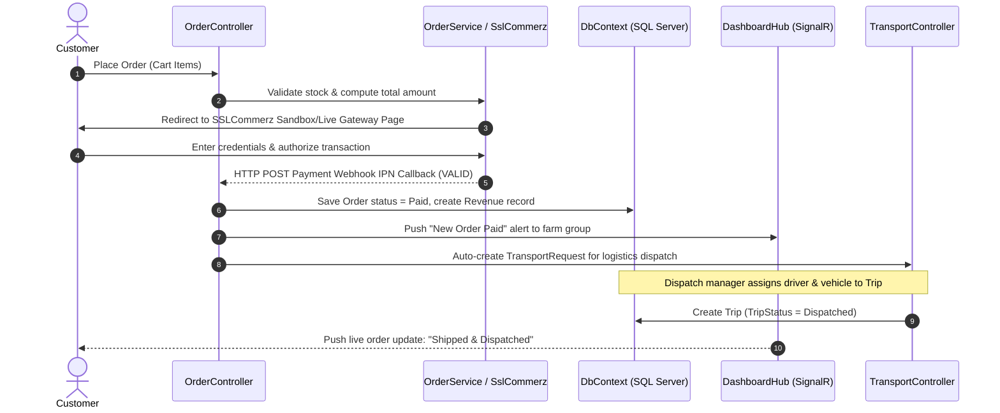

# 🐄 CattleFarm Project: Enterprise Smart Cattle Farm Management System
> **Comprehensive Architecture, Relational Schema, Service Workflows, & Developer Playbook**
> Designed and built as an enterprise-grade ASP.NET Core 10.0 MVC Web Application.

---

## 🎯 1. Project Goal & Overview
The **CattleFarm** system is a state-of-the-art **ASP.NET Core 10.0 MVC Web Application** designed to automate and manage all operations of a modern, smart cattle farm. By integrating livestock tracking, milking yield optimization, clinical veterinary registers, storefront e-commerce, and fleet logistics dispatches into a single database, the project enables farm owners to run a data-driven, highly optimized business.

### 👥 Role-Based Portals & Access Privileges
The system enforces strict role-based access control (RBAC) to ensure that users only interact with sections relevant to their duties:

| Role Badge | Primary Users | Key Operational Privileges & Core Views |
| :--- | :--- | :--- |
| `Admin` | System Administrators | Global configurations, database backups, audit trail inspection, user status/subscription approvals, system configuration. |
| `Owner` | Farm Owners | Full analytics dashboard access, worker recruitment & salary histories, financial expense logging, livestock catalog management, reports exports. |
| `Manager` | Herd Managers | Task assignments, milk yield tracking approvals, breeding calendars, vet schedules, diagnostics reviews, logistics requests creation. |
| `Worker` | Field Workers & Hands | Daily milking yield data entry, cattle feeding logs, task status updates, leave requests, attendance checks. |
| `Doctor` | Visiting Veterinarians | Clinical appointment viewing, health diagnosis records registry, vaccination schedules, medicine records prescribing. |
| `Customer` | Marketplace Buyers | Public storefront browsing, shopping cart flows, SSLCommerz checkouts, personal order tracking, and products reviews. |

---

## 🏗️ 2. Enterprise N-Layer Architecture
The application is built using a decoupled, highly maintainable **N-Layer Architecture** that isolates user-interface interactions, business computation rules, and database-access structures:



### Architectural Layer Breakdown
1. **Presentation Layer (Razor Views & ViewModels)**: Dynamic `.cshtml` templates combine semantic HTML5 layouts with C# Tag Helpers to render clean, interactive forms. Input ViewModels enforce declarative validation attributes (e.g., `[Required]`, `[Range]`, `[StringLength]`) to prevent over-posting and SQL-injection attacks at the client-entry boundary.
2. **Application Layer (Controllers & SignalR Hubs)**: Controllers map routes, handle incoming HTTP actions, verify role authentication policies, and coordinate interactions with the Service Layer. SignalR Hubs manage active WebSocket connections, enabling instantaneous push notifications to dashboards.
3. **Business Logic Layer (Services)**: The service boundary implements business calculations (e.g., milk daily averages, breeding gestation intervals, worker attendance rates) and coordinates integrations with third-party gateways (SslCommerz Payments, Gmail SMTP MailKit, local filesystem Image Processing).
4. **Data Access Layer (Repository & Unit of Work)**: Decouples domain services from the direct Entity Framework DbContext. Repositories encapsulate database query paths, using eager loading via `.Include()` and performance-tuned read-only collections via `.AsNoTracking()`. The **Unit of Work** aggregates all repositories, ensuring database changes are executed in a single atomic transaction.
5. **Database Model Layer (Entities & DbContext)**: Defines C# entity mappings to physical SQL Server tables. The DBContext manages connection strings, migration configurations, and applies custom configurations (e.g., unique indices, soft delete filters).

---

## 🗃️ 3. Relational Schema & EF Core Fluent API Configurations
The database configurations inside the main database context, [CattleFarmDbContext.cs](file:///f:/VisualStudio/CattleFarm/CattleFarm/Models/CattleFarmDbContext.cs), are configured via the EF Core Fluent API to enforce data integrity constraints and support enterprise-level auditing:



### 🔐 Relational Schema & Cascade Delete Protections
To prevent recursive cascade loops and SQL Server database schema migration conflicts, foreign keys are configured with `DeleteBehavior.Restrict` or `DeleteBehavior.SetNull`:

> [!CAUTION]
> Direct cascade deletions are blocked on critical entities. For example, deleting a `Farm` will not cascade-delete associated `Workers`, `Doctors`, or `Products`. System managers must manually reassign or archive these relationships before deletion.

* **Soft Delete Global Query Filters**: Entities implement a soft-delete status pattern via `IsDeleted`. Query filters registered in [CattleFarmDbContext.cs](file:///f:/VisualStudio/CattleFarm/CattleFarm/Models/CattleFarmDbContext.cs) (e.g., `modelBuilder.Entity<Cattle>().HasQueryFilter(c => !c.IsDeleted)`) guarantee that soft-deleted objects are automatically excluded from all application queries unless bypassed explicitly using `.IgnoreQueryFilters()`.
* **Unique Composite Indexes**: Composite constraints are applied to prevent invalid duplicate data-entry states:
  * `TagId + FarmId` in [Cattle.cs](file:///f:/VisualStudio/CattleFarm/CattleFarm/Models/Cattle.cs) ensures livestock identifier codes are unique within a farm context.
  * `WorkerId + Date` in [Attendance.cs](file:///f:/VisualStudio/CattleFarm/CattleFarm/Models/Attendance.cs) prevents duplicate daily attendance entries.
  * `WorkerId + Year + Month` in [SalaryHistory.cs](file:///f:/VisualStudio/CattleFarm/CattleFarm/Models/SalaryHistory.cs) ensures only one payroll record exists per worker per month.
* **Auto-Auditing Engine**: The DbContext overrides `SaveChanges` and `SaveChangesAsync` to intercept modifications, capturing user ID, timestamp, table name, and old/new values, saving them directly into `AuditLogs` and `ActivityLogs`.

---

## 🔄 4. Core Business Workflows & Execution Pipelines

### 🥛 Milking Production & Yield Analysis
This workflow enables workers to enter raw milk volumes, approves records, and automatically updates the dashboard visualizer trends.



### 🧬 Breeding Lifecycle & Gestation Alerts
Maintains the livestock reproduction pipeline, predicting birth dates and generating system alerts when calving dates approach.



### 🛒 Storefront Checkout, Payments, & Fleet Logistics
Tracks a customer's purchase path, validating transactions, updating farm finances, and dispatching logistics vehicles.



---

## 📁 5. Workspace Directory Structure & File Map
Below is the directory map of the entire workspace located at `f:\VisualStudio\CattleFarm\`:

```
f:\VisualStudio\CattleFarm\
│
├── CattleFarm.slnx                  # Visual Studio XML solution grouping projects
├── notes.text                       # Brief developer notes of the workspace
│
├── SQL Server Scripts1\             # Database setup scripts (SSMS Project)
│   ├── README.md                    # SSMS script folder guide
│   ├── SQL Server Scripts1.ssmssln  # SSMS solution grouping
│   └── SQL Server Scripts1/
│       ├── SQL Server Scripts1.ssmssqlproj
│       └── SeedData.sql             # SQL script with raw INSERT queries for manual database seeds
│
└── CattleFarm\                      # Main project directory (ASP.NET Core Web App)
    ├── Program.cs                   # Application bootstrap entry point & services registers
    ├── CattleFarm.csproj            # NuGet packages configuration & build profiles
    ├── AppRoles.cs                  # Definitions for global authorization roles
    ├── gmail.md                     # File mapping developer logins and passwords
    │
    ├── Authorization\               # Security policies & custom access checks
    │   └── FarmAuthorizationPolicies.cs # Farm ownership handler & policies definitions
    │
    ├── Hubs\                        # SignalR Websockets Hubs
    │   └── FarmDashboardHub.cs      # Real-time dashboard updates push
    │
    ├── Controllers\                 # MVC Controllers layer mapping request routes
    │   ├── AccountController.cs     # Authentication actions (login, logout, register)
    │   ├── CattleController.cs      # Cattle profiles management & listing
    │   ├── OrderController.cs       # E-Commerce checkouts & cart tracking
    │   ├── TransportController.cs   # Fleet dispatches, vehicle assets, driver trips
    │   ├── DashboardController.cs   # Role-tailored operational KPI grids
    │   └── README.md                # Controllers layer module map
    │
    ├── Models\                      # Data Entities and DBContext configurations
    │   ├── CattleFarmDbContext.cs   # Entity Framework Context & Fluent API setups
    │   ├── Cattle.cs                # Cattle profile domain entity properties
    │   ├── User.cs                  # Account credentials and roles structures
    │   ├── Enums.cs                 # System-wide enum status codes definitions
    │   └── README.md                # Database entity definitions map
    │
    ├── Repositories\                # Data access wrappers
    │   ├── Interfaces/              # Repository contract protocols
    │   ├── Implementations/         # Concrete EF Core implementations
    │   └── README.md                # Repositories architecture guide
    │
    ├── UnitOfWork\                  # Atomic transaction layer
    │   ├── IUnitOfWork.cs           # Database transaction interface
    │   └── UnitOfWork.cs            # Concrete Unit of Work implementation
    │
    ├── Services\                    # Business Logic Layer
    │   ├── Interfaces/              # Services interfaces definitions
    │   ├── Implementations/         # Core computations and API connectors classes
    │   │   ├── AuthService.cs       # Hashing and cookie authentication claims compiler
    │   │   ├── SslCommerzService.cs # REST API payment gateway client
    │   │   ├── NotificationService.cs # SignalR alerts generator and database writer
    │   │   └── ... (25+ service files)
    │   └── README.md                # Services architecture guide
    │
    ├── ViewModels\                  # Forms data mapping & validations (DTOs)
    │   └── DomainViewModels.cs      # Binds custom forms inputs & data validation
    │
    ├── Views\                       # Razor View pages template folders
    │   ├── Shared\_Layout.cshtml    # Master dashboard layout with role-based navigation sidebar
    │   ├── Account/Login.cshtml     # Login credentials input page
    │   ├── Transport/Requests.cshtml # Vehicle fleet dispatches interface
    │   └── README.md                # Razor Views layout map
    │
    └── wwwroot\                     # Compiled static client assets
        ├── css/                     # Styling custom stylesheets
        ├── js/                      # Real-time web socket integrations scripts
        └── uploads/                 # Local directory folders storing file uploads (cattle images, task proofs)
```

---

## ⚙️ 6. Core Infrastructure & Cross-Cutting Concerns

### 📝 Serilog Logging Framework
Logging is configured inside [Program.cs](file:///f:/VisualStudio/CattleFarm/CattleFarm/Program.cs). All information logs, diagnostic warnings, and critical exceptions are piped to two targets:
1. **Console Output**: For local debugging in the IDE terminal.
2. **Daily Rolling Log Files**: Saved under `/logs/cattlefarm-*.log`. The logging system automatically creates a new file at midnight, retaining files for up to 30 days before clean-up.

### ⚡ SignalR Real-time Websockets
Real-time messaging is handled by [FarmDashboardHub.cs](file:///f:/VisualStudio/CattleFarm/CattleFarm/Hubs/FarmDashboardHub.cs). Client connections join specific communication groups:
* `farm:{farmId}`: Broadcasts farm production counts, health alerts, and milking updates to managers.
* `user:{userId}`: Sends private notifications, order status changes, and task alerts to specific users.

### 🔒 Cookie Authentication & Security Settings
User authentication is managed using HTTP Cookie-based state, avoiding stateless JWT overhead for MVC pages:
* **Cookie Expiration**: Set to an 8-hour expiry with `SlidingExpiration = true`, extending active sessions if user activity is detected.
* **Security Settings**: Cookies are configured with `HttpOnly = true` to block access from JavaScript scripts, and `SameAsRequest` secure policies.
* **Form Upload Size Limits**: The web server multipart forms are configured to support up to **10 MB** per request. Image and document upload services apply a stricter **5 MB** per-file validation limit for livestock photos, avatars, task proofs, and supported PDF attachments.

---

## 🔑 7. Seeded Development Credentials

To test user access controls locally, log in using the pre-seeded credentials populated by the database initializers inside [DbSeeder.cs](file:///f:/VisualStudio/CattleFarm/CattleFarm/Data/DbSeeder.cs):

| Portal Role | Email Address | Password | Development Testing Role & Privileges |
| :--- | :--- | :--- | :--- |
| **System Admin** | `admin@cattlefarm.com` | `Admin@123` | View global dashboards, audits, and configuration settings. |
| **Farm Owner** | `owner@farm.com` | `Owner@123` | Control "Green Pasture Farm" financials, worker rolls, and reports. |
| **Herd Manager**| `manager@cattlefarm.com` | `Manager@123` | Manage daily milk approvals, tasks assignation, and vet slots. |
| **Field Worker**| `worker@farm.com` | `Worker@123` | Log milking volumes and submit tasks completions. |
| **Veterinarian**| `doctor@farm.com` | `Doctor@123` | Inspect animal health charts and vaccination statuses. |
| **Customer** | `customer@farm.com` | `Customer@123` | Purchase products via storefront and pay via SSLCommerz. |

---

## 🛠️ 8. Developer Operational Playbook & Troubleshooting

### 🧪 Database Migrations & Initial Setup
1. **Initialize or Update Database Schema**:
   Ensure Entity Framework CLI tools compile the code and apply the migrations to your local SQL Server instance:
   ```powershell
   dotnet ef database update --project CattleFarm
   ```
2. **Creating New Migrations**:
   If domain model property modifications are made, create a new named migration step:
   ```powershell
   dotnet ef migrations add <MigrationName> --project CattleFarm
   ```
3. **Database Context Info**:
   To print out details of the active database host, provider, and schema info:
   ```powershell
   dotnet ef db context info --project CattleFarm
   ```

### 🏃 Running the Application
To run the ASP.NET Core web server locally:
```powershell
dotnet run --project CattleFarm
```
Once initialized, navigate to `http://localhost:5000` (or the local SSL port shown in the console) to open the account login portal.

---

### ⚠️ Common Troubleshooting Guide

> [!WARNING]
> **Issue: Database update fails due to 'PendingModelChangesWarning'**
> * **Solution**: ASP.NET Core 10.0 enforces warnings on pending model checks. We configure DB warnings to ignore this in [Program.cs](file:///f:/VisualStudio/CattleFarm/CattleFarm/Program.cs#L27-L28). Ensure your context options include:
>   `ConfigureWarnings(warnings => warnings.Ignore(RelationalEventId.PendingModelChangesWarning))`

> [!IMPORTANT]
> **Issue: Uploaded images or task proofs throw a DirectoryNotFoundException**
> * **Solution**: The application seeder attempts to create standard upload folders. If these folders are deleted, re-run `dotnet run` to recreate them, or manually verify that paths exist under `CattleFarm/wwwroot/uploads/`:
>   `avatars/`, `cattle/`, `farms/`, `products/`, `workers/`, `task-proofs/`

> [!TIP]
> **Issue: SSLCommerz checkout requests fail to validate in Sandbox Mode**
> * **Solution**: Ensure your local internet connections allow external HTTPS calls. Verify sandbox API details in your local configurations: [appsettings.json](file:///f:/VisualStudio/CattleFarm/CattleFarm/appsettings.json) should contain valid sandbox endpoints:
>   `https://sandbox.sslcommerz.com/gwprocess/v4/api.php`
