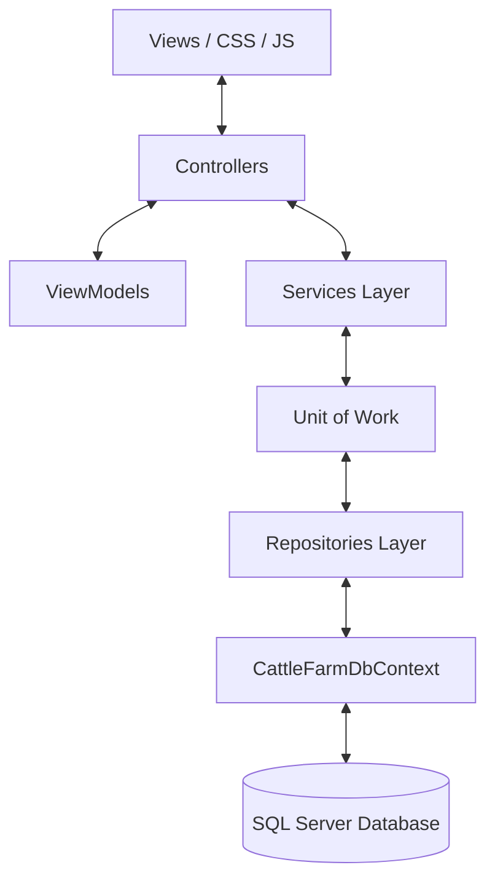

# 🐄 Smart Cattle Farm - Project Setup & Architecture Map

Welcome to the **Smart Cattle Farm** codebase directory and configuration setup map. This document serves as a developer-friendly reference guide explaining the role of every directory, key files, and operational pipelines in the system.

---

## 🏗️ System Architecture Overview

The application is built on **ASP.NET Core 10.0 MVC** using a **Clean Architecture/N-Tier** hybrid design utilizing the **Repository and Unit of Work** patterns. 



*   **Presentation Layer (MVC):** `Controllers/`, `Views/`, `wwwroot/`
*   **Abstraction & Data Binding:** `ViewModels/`
*   **Business Logic Layer:** `Services/`
*   **Data Access Layer (DAL):** `Models/`, `Repositories/`, `UnitOfWork/`, `Migrations/`

---

## 📁 Complete Folder Tree Map

Below is a bird's-eye view of the application layout within the `CattleFarm/` directory:

```text
CattleFarm/
├── AppRoles.cs                  # Compile-time user authentication roles
├── CattleFarm.csproj            # ASP.NET Core project build definitions
├── Program.cs                   # Application entry point, services setup, and middleware pipeline
├── appsettings.json             # App configurations (Connection Strings, SMTP, SSLCommerz credentials)
├── Controllers/                 # HTTP Request Handlers (Page routing & API endpoints)
├── Data/                        # System-wide seeding routines (default roles, users, and data structures)
├── Migrations/                  # EF Core Database Schema versions & Snapshots
├── Models/                      # Entity models mapped directly to SQL Server tables
├── Repositories/                # Database query abstractions & CRUD wrappers per entity
├── Services/                    # Core business logic logic (Domain operations, backgrounds, email, etc.)
│   ├── Background/              # Long-running background processes (auto-expiry etc.)
│   ├── Implementations/         # Logic implementations of interfaces
│   └── Interfaces/              # Contract declarations for services
├── UnitOfWork/                  # Handles database transactional consistency across multiple repositories
├── ViewModels/                  # Strictly-typed data models for form bindings & API responses
├── Views/                       # HTML views & Razor Pages for presentation
└── wwwroot/                     # Static assets (images, stylesheets, uploads, task proofs)
```

---

## 📐 Detailed Directory & File Mappings

### 1. 📁 `Models/` (Core Data Models)
Contains entities mapping directly to your database tables.

| File Name | Functional Purpose / Role |
| :--- | :--- |
| `CattleFarmDbContext.cs` | Main database context coordinator. Sets up relationships, indexes, global query filters, and soft delete configs. |
| `User.cs` | User accounts structure tracking names, emails, roles, subscription state, passwords, and security flags. |
| `Farm.cs` | Facility profile model tracking GPS coordinates, capacity, acres, type, active status, and association with Owner. |
| `Worker.cs` & `FarmWorker.cs` | Tracks worker employment details, salaries, farm bindings, hiring statuses, and specific operating roles. |
| `Cattle.cs` | Main livestock inventory tracker. Records breeds, gender, weights, age tags, parent dams, and status tags. |
| `MilkProduction.cs` | Daily operational logging. Captures morning/evening session yields per cattle and per farm. |
| `FeedRecord.cs` | Operational log capturing food rations (grains, hay, silage) and quantities consumed by livestock. |
| `Doctor.cs` & `Appointment.cs` | Veterinarian directories and scheduled appointment logs for tracking livestock medical visits. |
| `HealthRecord.cs` & `MedicineRecord.cs` | Diagnoses, prescription pads, and specific withdrawal tracking for administered medicines. |
| `Vaccination.cs` | Dynamic schedule tracking vaccine doses and booster schedules. |
| `Breeding.cs` | Gestation timelines, sire/dam maps, pregnancy calculations, and calving schedules. |
| `TaskAssignment.cs` | Dynamic task assignments containing priority details, expires durations, bonuses, and proof-upload states. |
| `Payroll.cs` | Monthly payroll ledger logs reflecting base salaries, overtime hours, bonuses, and payment verifications. |
| `Product.cs`, `Order.cs`, `OrderItem.cs` | E-commerce items, administrative order checkouts, shopping carts, and delivery details. |
| `Payment.cs` | Integrates SSLCommerz payment credentials, validation statuses, and transactions. |
| `Driver.cs`, `Vehicle.cs`, `Trip.cs`, `TransportRequest.cs` | Logistics management dispatcher handling delivery dispatches, vehicle fuel consumption, and transit milestones. |

---

### 2. 📁 `Controllers/` (HTTP Request Handlers)
Handles routing incoming requests, authorizing roles, processing input, and serving views.

*   `AccountController.cs`: Coordinates logins, registrations, password resets, profile updates, and active session cookies.
*   `FarmController.cs` & `CattleController.cs`: Coordinates facility configurations and livestock inventory CRUD dashboards.
*   `FarmJoinController.cs`: Custom workflow allowing freelancers/workers to search for farms and request to join their crews.
*   `TaskAssignmentController.cs`: Enables owners to assign direct/open tasks, and allows workers to accept, submit proof, or review.
*   `PayrollController.cs`: Financial ledger dashboard generating monthly worker payrolls, overtime settings, and pay statuses.
*   `OrderController.cs` & `ProductController.cs`: Backs customer marketplace purchasing, checkouts, and shipping updates.
*   `TransportController.cs`: Dispatches vehicles and tracks driver logs for paid orders automatically.
*   `DashboardController.cs`: The core entry screen rendering targeted role-based analytical charts (Chart.js dashboards).

---

### 3. 📁 `Services/` (Business & Domain Logic Layer)
This is where all complex business calculations and operations take place.

*   **Background Services:**
    *   `TaskExpiryBackgroundService.cs`: Runs every 5 minutes in the background, automatically expiring open tasks that have passed their expiration date.
*   **Services Implementations:**
    *   `TaskAssignmentService.cs`: Handles claim lock transactions (race-condition protection), handles filesystems, and manages proofs.
    *   `PayrollService.cs`: Generates monthly payroll logs, aggregates wages, processes overtime increments, and marks disbursements.
    *   `SslCommerzService.cs`: Communicates with SSLCommerz gateway APIs, handling token exchanges and transaction webhooks.
    *   `DashboardService.cs`: Consolidates multi-tenant performance analytics, financial sheets, feed consumption rates, and breeding timelines.
    *   `FarmJoinService.cs`: Coordinates application requests, prevents worker double-bindings, and updates roles in the system.

---

### 4. 📁 `Repositories/` (Data Query Layers)
Wraps DbContext operations inside compile-time repository contracts.

*   `IRepository.cs` & `Repository.cs`: Generic CRUD patterns providing reusable standard queries (`Add`, `Delete`, `GetById`, `List`).
*   `ICattleRepository.cs`, `IOrderRepository.cs`, `IWorkerRepository.cs` etc.: Implemented wrappers tailored for complex joins (e.g., loading children, nested relationships, and filtering soft-deleted rows).

---

### 5. 📁 `UnitOfWork/` (Transaction Management)
Coordinates atomic transactions when changing multiple entities simultaneously.

*   `IUnitOfWork.cs` & `UnitOfWork.cs`: Unifies all repositories under a single transaction. Ensures that if saving an Order fails, its associated Inventory or Revenue changes rollback cleanly.

---

### 6. 📁 `ViewModels/` (Strict Form Bindings)
Maintains standard Data Annotation rules (`[Required]`, `[Range]`, validations) representing request payloads.

*   `TaskAssignmentViewModels.cs`: Form configurations backing task assignments, proof submissions, and owner approvals.
*   `PayrollViewModels.cs` & `EmployeePayrollViewModels.cs`: Inputs and financial structures matching wages edit/create payloads.
*   `FarmJoinViewModels.cs`: Application submissions, notes, and approval status panels.
*   `LoginViewModel.cs` & `RegisterViewModel.cs`: Core inputs validation protecting registration and login forms.

---

### 7. 📁 `Views/` (Razor Presentation Layer)
The views are split into folders representing their controller names. Main layout components:
*   `Shared/_Layout.cshtml`: Dynamic master page rendering custom dark-themed panels, navigation sidebars, and alert widgets.
*   `Dashboard/Customer.cshtml` & `Dashboard/Admin.cshtml`: Stunning analytical dashboards customized with charts.
*   `TaskAssignment/OpenBoard.cshtml` & `TaskAssignment/Index.cshtml`: Interactive task boards for workers and management.

---

## 🚀 Setting Up the Application

Follow these steps to run the Smart Cattle Farm application locally on your Windows system:

### 1. Prerequisite Installations
*   Ensure **.NET 10.0 SDK** is installed on your computer.
*   Ensure **SQL Server** and **SQL Server Management Studio (SSMS)** are running locally.

### 2. Update Database Connection String
Open [appsettings.json](file:///f:/VisualStudio/CattleFarm/CattleFarm/appsettings.json) and configure your local SQL Server instance:
```json
"ConnectionStrings": {
  "DefaultConnection": "Server=YOUR_SERVER_NAME;Database=CattleFarmDB;Trusted_Connection=True;TrustServerCertificate=True;MultipleActiveResultSets=True;"
}
```

### 3. Apply Migrations and Update Database
Open PowerShell in the `CattleFarm/CattleFarm` directory and run the following to apply the database migrations:
```powershell
dotnet ef database update
```
*(This will automatically build the tables, schemas, indexes, and run the `DbSeeder.cs` scripts to insert default admin/system roles).*

### 4. Run the Dev Server
Launch the local development server:
```powershell
dotnet run
```
Open your browser and navigate to `https://localhost:7170` to view the beautiful Smart Cattle Farm UI!
